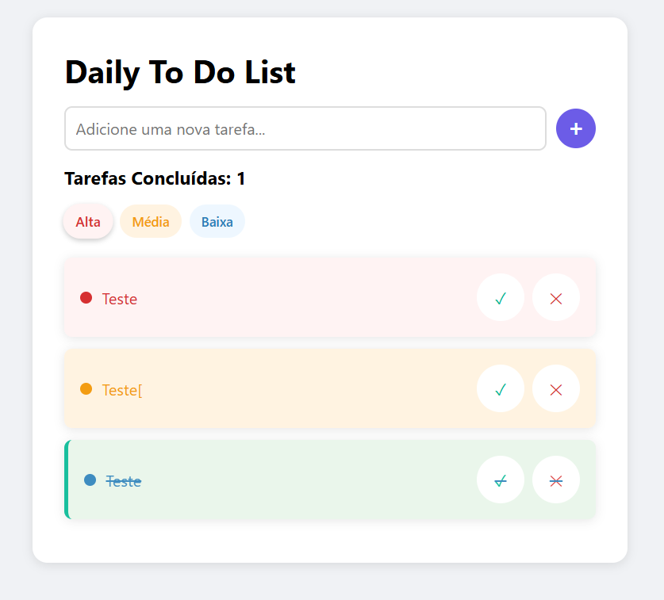

# 📋 Daily To-Do List  

**O Seu aplicativo minimalista para gestão de tarefas diárias** 
 
[](https://opensource.org/licenses/MIT) 
  

<p align="center">
  
</p>

---

## ✨ Funcionalidades  
✅ **Priorização Flexível**  
- Níveis de prioridade (Alta/Média/Baixa)  
- Ordenação automática por urgência  

✅ **Controle de Progresso**  
- Contador de tarefas concluídas  
- Efeito visual de conclusão com animação  

✅ **Persistência de Dados**  
- Armazenamento local via `localStorage`  
- Recuperação de tarefas após fechar o navegador  

✅ **Design Intuitivo**  
- Interface responsiva (mobile/desktop)  
- Animações suaves em todas as interações  

✅ **Acessibilidade**  
- Navegação por teclado (Enter para adicionar)  
- Alto contraste e labels semânticas  

---

## 🚀 Comece Agora  

### Pré-requisitos  
- Navegador moderno (Chrome 90+, Firefox 88+, Edge 90+)  

### Instalação Local  
```
# Clone o repositório
git clone https://github.com/JuliaNazka/daily-todo-list.git

# Acesse a pasta
cd daily-todo-list

# Execute com live-server (opcional)
npx live-server --port=3000
```

# 🛠 Tecnologias Utilizadas

| Tecnologia       | Função Principal               | 
|------------------|--------------------------------|
|  | Estrutura semântica da interface | 
|  | Estilização e responsividade | 
|  | Lógica interativa | 
|  | Persistência de dados | 

---

# 📂 Estrutura do Projeto

```plaintext
daily-todo-list/
├── index.html        # Interface principal
├── style.css         # Estilos globais
├── script.js         # Lógica da aplicação
├── LICENSE           # Licença MIT
├── Print-Todo.png    # Imagem do Projeto
└── docs/             # Documentação complementar
    ├── ARCHITECTURE.md
    └── TEST_PLAN.md 
```

📄 Licença
Distribuído sob licença MIT. Veja LICENSE para detalhes.

  